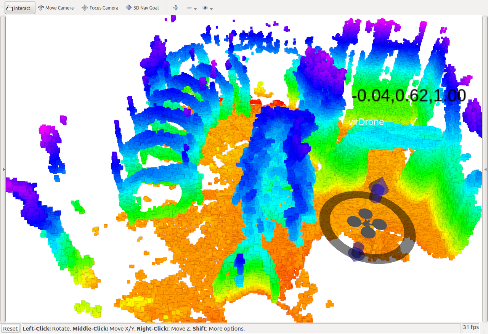

# Rviz Interaction Panel for Autonomous MAV

This is a project developed from https://github.com/ros-visualization/visualization_tutorials

## Features

This project is used to set target position during drone autonomous navigation,
- Displaying prebuilt point cloud map;
- Add an interactive marker to set target position;
- The interactive marker can be dragged. 
- Target position will be published as /target_pose


## Get Start
### Prerequest
Install ROS Kinetic.
Install rviz_visual_tools: https://github.com/glennliu/rviz_visual_tools

### Install
````bash
cd $catkin_workspace/src
git clone https://github.com/glennliu/visualization-tutorials;
cd $catkin_workspace
catkin_make
````

### Run the program

````bash
roslaunch interactive_marker_tutoirals airborne.launch
````

## Enjoy